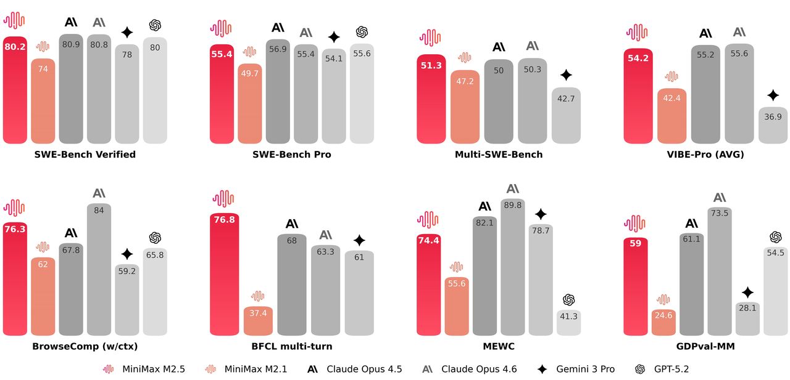
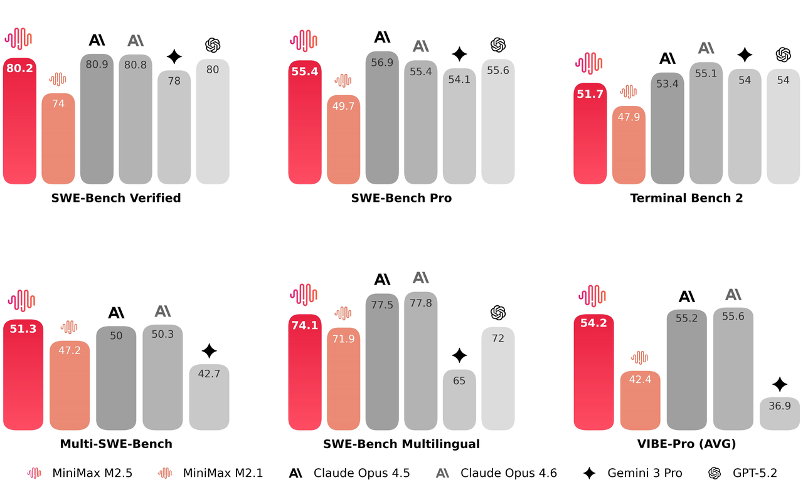
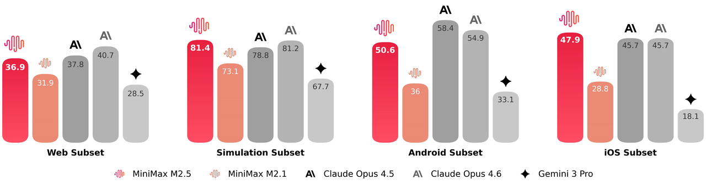
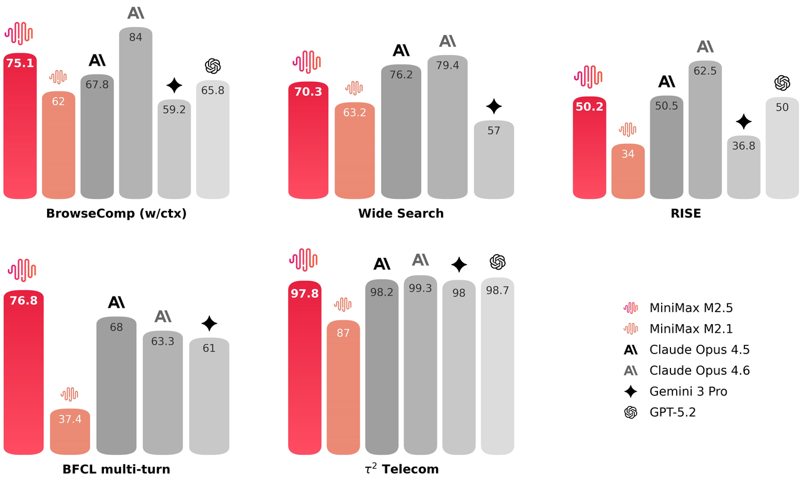
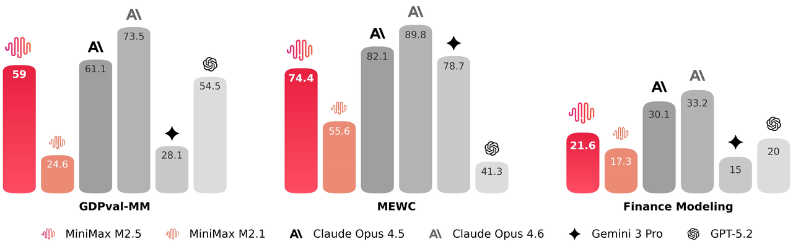
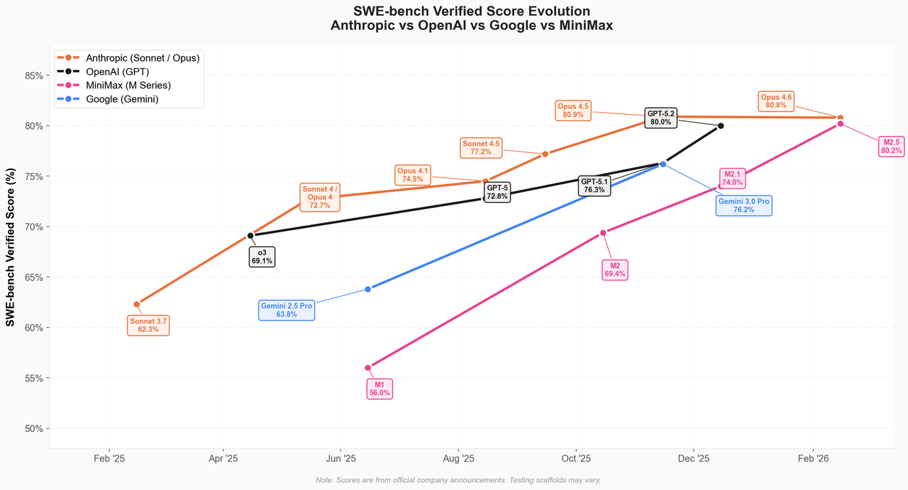
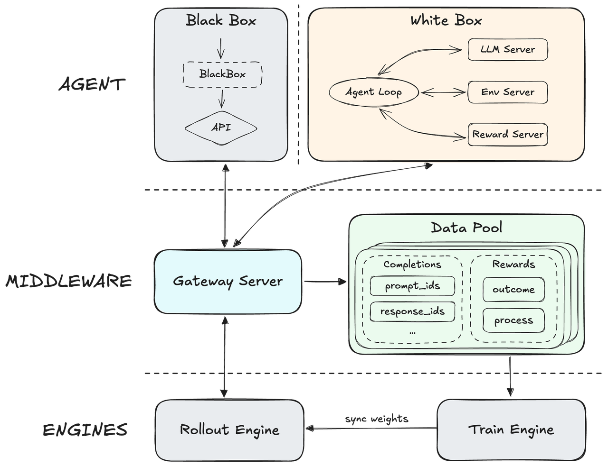
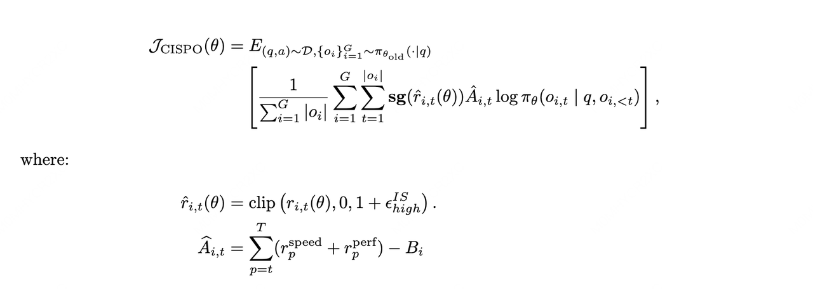

<div align="center">
  <picture>
    <source srcset="figures/MiniMaxLogo-Dark.png" media="(prefers-color-scheme: dark)">
      
    </source>
  </picture>
</div>
<hr>

<div align="center" style="line-height: 1.4; font-size:16px; margin-top: 30px;">
  Join Our 
  <a href="https://platform.minimaxi.com/docs/faq/contact-us" target="_blank" style="font-size:17px; margin: 2px;">
    💬 WeChat
  </a> | 
  <a href="https://discord.gg/minimax" target="_blank" style="font-size:17px; margin: 2px;">
    🧩 Discord
  </a> 
  community.
</div>
<div align="center" style="line-height: 1.2; font-size:16px;">
  <a href="https://agent.minimax.io/" target="_blank" style="display: inline-block; margin: 4px;">
    MiniMax Agent
  </a> | 
  <a href="https://platform.minimax.io/docs/guides/text-generation" target="_blank" style="display: inline-block; margin: 4px;">
    ⚡️ API
  </a> | 
  <a href="https://github.com/MiniMax-AI/MiniMax-MCP" style="display: inline-block; margin: 4px;">
    MCP
  </a> |
  <a href="https://www.minimax.io" target="_blank" style="display: inline-block; margin: 4px;">
    MiniMax Website
  </a> 
</div>
<div align="center" style="line-height: 1.2; font-size:16px; margin-bottom: 30px;">
  <a href="https://huggingface.co/MiniMaxAI" target="_blank" style="margin: 2px;">
    🤗 Hugging Face 
  </a> | 
  <a href="https://github.com/MiniMax-AI/MiniMax-M2.1" target="_blank" style="margin: 2px;">
    🐙 GitHub
  </a> | 
  <a href="https://www.modelscope.cn/organization/MiniMax" target="_blank" style="margin: 2px;">
    🤖️ ModelScope
  </a> | 
  <a href="https://github.com/MiniMax-AI/MiniMax-M2.5/blob/main/LICENSE" style="margin: 2px;">
    📄 License: Modified-MIT
  </a>
</div>

<p align="center">
  <picture>
    <source srcset="figures/bench_11.png" media="(prefers-color-scheme: dark)">
      
    </source>
  </picture>
</p>

Today we're introducing our latest model, **MiniMax-M2.5**.

Extensively trained with reinforcement learning in hundreds of thousands of complex real-world environments, M2.5 is **SOTA in coding, agentic tool use and search, office work, and a range of other economically valuable tasks**, boasting scores of **80.2% in SWE-Bench Verified, 51.3% in Multi-SWE-Bench, and 76.3% in BrowseComp** (with context management).

Trained to reason efficiently and decompose tasks optimally, M2.5 exhibits tremendous speed in performing complicated agentic tasks, completing the SWE-Bench Verified evaluation **37% faster** than M2.1, matching the speed of **Claude Opus 4.6**.

M2.5 is the first frontier model where users do not need to worry about cost, delivering on the promise of intelligence too cheap to meter. **It costs just $1 to run the model continuously for an hour at a rate of 100 tokens per second.** At 50 tokens per second, the cost drops to $0.30. We hope that the speed and cost effectiveness of M2.5 enable innovative new agentic applications.

## Coding

In programming evaluations, MiniMax-M2.5 saw substantial improvements compared to previous generations, reaching SOTA levels. The performance of M2.5 in multilingual tasks is especially pronounced.

<p align="center">
  <picture>
    <source srcset="figures/bench_2.png" media="(prefers-color-scheme: dark)">
      
    </source>
  </picture>
</p>

A significant improvement from previous generations is M2.5's ability to think and plan like an architect. The Spec-writing tendency of the model emerged during training: before writing any code, M2.5 actively decomposes and plans the features, structure, and UI design of the project from the perspective of an experienced software architect.

M2.5 was trained on over 10 languages (including Go, C, C++, TypeScript, Rust, Kotlin, Python, Java, JavaScript, PHP, Lua, Dart, and Ruby) across more than 200,000 real-world environments. Going far beyond bug-fixing, M2.5 delivers reliable performance across the entire development lifecycle of complex systems: from 0-to-1 system design and environment setup, to 1-to-10 system development, to 10-to-90 feature iteration, and finally 90-to-100 comprehensive code review and system testing. It covers full-stack projects spanning multiple platforms including Web, Android, iOS, and Windows, encompassing server-side APIs, business logic, databases, and more, not just frontend webpage demos.

To evaluate these capabilities, we also upgraded the VIBE benchmark to a more complex and challenging Pro version, significantly increasing task complexity, domain coverage, and evaluation accuracy. Overall, M2.5 performs on par with Opus 4.5.

<p align="center">
  <picture>
    <source srcset="figures/bench_4.png" media="(prefers-color-scheme: dark)">
      
    </source>
  </picture>
</p>

We focused on the model's ability to generalize across out-of-distribution harnesses. We tested performance on the SWE-Bench Verified evaluation set using different coding agent harnesses. 
- On Droid: 79.7(M2.5) > 78.9(Opus 4.6)
- On OpenCode: 76.1(M2.5) >  75.9(Opus 4.6)

## Search and Tool calling

<p align="center">
  <picture>
    <source srcset="figures/bench_6.png" media="(prefers-color-scheme: dark)">
      
    </source>
  </picture>
</p>

Effective tool calling and search are prerequisites for a model's ability to autonomously handle more complex tasks. In evaluations on benchmarks such as BrowseComp and Wide Search, M2.5 achieved industry-leading performance. At the same time, the model's generalization has also improved — M2.5 demonstrates more stable performance when facing unfamiliar scaffolding environments.

In research tasks performed by professional human experts, using a search engine is only a small part of the process; most of the work involves deep exploration across information-dense webpages. To address this, we built RISE (Realistic Interactive Search Evaluation) to measure a model's search capabilities on real-world professional tasks. The results show that M2.5 excels at expert-level search tasks in real-world settings.

Compared to its predecessors, M2.5 also demonstrates much better decision-making when handling agentic tasks: it has learned to solve problems with more precise search rounds and better token efficiency. For example, across multiple agentic tasks including BrowseComp, Wide Search, and RISE, M2.5 achieved better results with fewer rounds, using approximately 20% fewer rounds compared to M2.1. This indicates that the model is no longer just getting the answer right, but is also reasoning towards results in more efficient paths.

## Office work

M2.5 was trained to produce truly deliverable outputs in office scenarios. To this end, we engaged in thorough collaboration with senior professionals in fields such as finance, law, and social sciences. They designed requirements, provided feedback, participated in defining standards, and directly contributed to data construction, bringing the tacit knowledge of their industries into the model's training pipeline. Based on this foundation, M2.5 has achieved significant capability improvements in high-value workspace scenarios such as Word, PowerPoint, and Excel financial modeling. On the evaluation side, we built an internal Cowork Agent evaluation framework (GDPval-MM) that assesses both the quality of the deliverable and the professionalism of the agent's trajectory through pairwise comparisons, while also monitoring token costs across the entire workflow to estimate the model's real-world productivity gains. In comparisons against other mainstream models, it achieved an average win rate of 59.0%.

<p align="center">
  <picture>
    <source srcset="figures/bench_8.png" media="(prefers-color-scheme: dark)">
      
    </source>
  </picture>
</p>

## Efficiency

Because the real world is full of deadlines and time constraints, task completion speed is a practical necessity. The time it takes a model to complete a task depends on its task decomposition effectiveness, token efficiency, and inference speed. M2.5 is served natively at a rate of 100 tokens per second, which is nearly twice that of other frontier models. Further, our reinforcement learning setup incentivizes the model to reason efficiently and break down tasks optimally. Due to these three factors, M2.5 delivers a significant time savings in complex task completion.

For example, when running SWE-Bench Verified, M2.5 consumed an average of 3.52 million tokens per task. In comparison, M2.1 consumed 3.72M tokens. Meanwhile, thanks to improvements in capabilities such as parallel tool calling, the end-to-end runtime decreased from an average of 31.3 minutes to 22.8 minutes, representing a 37% speed improvement. This runtime is on par with Claude Opus 4.6's 22.9 minutes, while the total cost per task is only 10% that of Claude Opus 4.6.

## Cost

Our goal in designing the M2-series of foundation models is to power complex agents without having to worry about cost. We believe that M2.5 is close to realizing this goal. We’re releasing two versions of the model, M2.5 and M2.5-Lightning, that are identical in capability but differ in speed. M2.5-Lightning has a steady throughput of 100 tokens per second, which is two times faster than other frontier models, and costs $0.3 per million input tokens and $2.4 per million output tokens. M2.5, which has a throughput of 50 tokens per second, costs half that. Both model versions support caching. Based on output price, the cost of M2.5 is one-tenth to one-twentieth that of Opus, Gemini 3 Pro, and GPT-5.

At a rate of 100 output tokens per second, running M2.5 continuously for an hour costs $1. At a rate of 50 TPS, the price drops to $0.3. To put that into perspective, you can have four M2.5 instances running continuously for an entire year for $10,000. We believe that M2.5 provides virtually limitless possibilities for the development and operation of agents in the economy. For the M2-series, the only problem that remains is how to continually push the frontier of model capability.

## Improvement Rate

Over the three and a half months from late October to now, we have successively released M2, M2.1, and M2.5, with the pace of model improvement exceeding our original expectations. For instance, in the highly-regarded  SWE-Bench Verified benchmark, the rate of progress of the M2-series has been significantly faster than that of peers such as the Claude, GPT, and Gemini model families.

<p align="center">
  
</p>

## RL Scaling

One of the key drivers of the aforementioned developments is the scaling of reinforcement learning. As we train our models, we also benefit from their abilities. Most of the tasks and workspaces that we perform in our company have been made into training environments for RL. To date, there are already hundreds of thousands of such environments. At the same time, we did plenty of work on our agentic RL framework, algorithms, reward signals, and infrastructure engineering to support the continued scaling of our RL training.

### Forge –– Agent-Native RL Framework

We designed an agent-native RL framework in-house, called Forge, which introduces an intermediary layer that fully decouples the underlying training-inference engine from the agent, supporting the integration of arbitrary agents and enabling us to optimize the model's generalization across agent scaffolds and tools. To improve system throughput, we optimized asynchronous scheduling strategies to balance system throughput against sample off-policyness, and designed a tree-structured merging strategy for training samples, achieving approximately 40x training speedup.

<p align="center">
  
</p>

### Agentic RL Algorithm and Reward Design

On the algorithm side, we continued using the CISPO algorithm we proposed at the beginning of last year to ensure the stability of MoE models during large-scale training. To address the credit assignment challenge posed by long contexts in agent rollouts, we introduced a process reward mechanism for end-to-end monitoring of generation quality. Furthermore, to deeply align with user experience, we evaluated task completion time through agent trajectories, achieving an optimal trade-off between model intelligence and response speed.

<p align="center">
  
</p>

We will release a more comprehensive introduction to RL scaling soon in a separate technical blogpost.

## MiniMax Agent: M2.5 as a Professional Employee

M2.5 has been fully deployed in MiniMax Agent, delivering the best agentic experience.

We have distilled core information-processing capabilities into standardized Office Skills deeply integrated within MiniMax Agent. In MAX mode, when handling tasks such as Word formatting, PowerPoint editing, and Excel calculations, MiniMax Agent automatically loads the corresponding Office Skills based on file type, improving the quality of task outputs.

Furthermore, users can combine Office Skills with domain-specific industry expertise to create reusable Experts tailored to specific task scenarios.

Take industry research as an example: by merging a mature research framework SOP (standard operating procedure) with Word Skills, the Agent can strictly follow the established framework to automatically fetch data, organize analytical logic, and output properly formatted research reports — rather than merely generating a raw block of text. In financial modeling scenarios, by combining an organization's proprietary modeling standards with Excel Skills, the Agent can follow specific risk control logic and calculation standards to automatically generate and validate complex financial models, rather than simply outputting a basic spreadsheet.

To date, users have built over 10,000 Experts on MiniMax Agent, and this number is still growing rapidly. MiniMax has also built multiple sets of deeply optimized, ready-to-use Expert suites on MiniMax Agent for high-frequency scenarios such as office work, finance, and programming.

MiniMax itself has been among the first to benefit from M2.5's capabilities. Throughout the company's daily operations, 30% of overall tasks are autonomously completed by M2.5, spanning functions including R&D, product, sales, HR, and finance — and the penetration rate continues to rise. Performance in coding scenarios has been particularly notable, with M2.5-generated code accounting for 80% of newly committed code.

## How to Use

MiniMax Agent: https://agent.minimax.io/

MiniMax API Platform: https://platform.minimax.io/

MiniMax Coding Plan: https://platform.minimax.io/subscribe/coding-plan

## Local Deployment Guide

Download the model from HuggingFace repository: https://huggingface.co/MiniMaxAI/MiniMax-M2.5

We recommend using the following inference frameworks (listed alphabetically) to serve the model:

### SGLang

We recommend using [SGLang](https://docs.sglang.io/) to serve MiniMax-M2.5. Please refer to our [SGLang Deployment Guide](./docs/sglang_deploy_guide.md).

### vLLM

We recommend using [vLLM](https://github.com/vllm-project/recipes/blob/main/MiniMax/MiniMax-M2.md) to serve MiniMax-M2.5. Please refer to our [vLLM Deployment Guide](./docs/vllm_deploy_guide.md).

### Transformers

We recommend using [Transformers](https://github.com/huggingface/transformers) to serve MiniMax-M2.5. Please refer to our [Transformers Deployment Guide](./docs/transformers_deploy_guide.md).

### KTransformers

We recommend using [KTransformers](https://github.com/kvcache-ai/ktransformers) to serve MiniMax-M2.5. Please refer to [KTransformers Deployment Guide](https://github.com/kvcache-ai/ktransformers/blob/main/doc/en/MiniMax-M2.5.md)

### Inference Parameters

We recommend using the following parameters for best performance: `temperature=1.0`, `top_p = 0.95`, `top_k = 40`. Default system prompt:

```
You are a helpful assistant. Your name is MiniMax-M2.5 and is built by MiniMax.
```

## Tool Calling Guide

Please refer to our [Tool Calling Guide](./docs/tool_calling_guide.md).

## Contact Us

Contact us at [model@minimax.io](mailto:model@minimax.io).


## Appendix

Further benchmark results of M2.5:

| Benchmark | MiniMax-M2.5 | MiniMax-M2.1 | Claude Sonnet 4.5 | Claude Opus 4.5 | Claude Opus 4.6 | Gemini 3 Pro | GPT-5.2 (thinking) |
|---|---|---|---|---|---|---|---|
| AIME25 | 86.3 | 83.0 | 88.0 | 91.0 | 95.6 | 96.0 | 98.0 |
| GPQA-D | 85.2 | 83.0 | 83.0 | 87.0 | 90.0 | 91.0 | 90.0 |
| HLE w/o tools | 19.4 | 22.2 | 17.3 | 28.4 | 30.7 | 37.2 | 31.4 |
| SciCode | 44.4 | 41.0 | 45.0 | 50.0 | 52.0 | 56.0 | 52.0 |
| IFBench | 70.0 | 70.0 | 57.0 | 58.0 | 53.0 | 70.0 | 75.0 |
| AA-LCR | 69.5 | 62.0 | 66.0 | 74.0 | 71.0 | 71.0 | 73.0 |

Evaluation methods:
> - SWE benchmark: SWE-bench Verified, SWE-bench Multilingual, SWE-bench-pro, and Multi-SWE-bench were tested on internal infrastructure using Claude Code as the scaffolding, with the default system prompt overridden, and results averaged over 4 runs. Additionally, SWE-bench Verified was also evaluated on the Droid and Opencode scaffoldings using the default prompt.
> - Terminal Bench 2: We tested Terminal Bench 2 using Claude Code 2.0.64 as the evaluation scaffolding. We modified the Dockerfiles of some problems to ensure the correctness of the problems themselves, uniformly expanded sandbox specifications to 8-core CPU and 16 GB memory, set the timeout uniformly to 7,200 seconds, and equipped each problem with a basic toolset (ps, curl, git, etc.). While not retrying on timeouts, we added a detection mechanism for empty scaffolding responses, retrying tasks whose final response was empty to handle various abnormal interruption scenarios. Final results are averaged over 4 runs.
> - VIBE-Pro: Internal benchmark. Uses Claude Code as the scaffolding to automatically verify the interaction logic and visual effects of programs. All scores are computed through a unified pipeline that includes a requirements set, containerized deployment, and a dynamic interaction environment. Final results are averaged over 3 runs.
> - BrowseComp: Uses the same agent framework as WebExplorer (Liu et al., 2025). When token usage exceeds 30% of the maximum context, all history is discarded.
> - Wide Search: Uses the same agent framework as WebExplorer (Liu et al., 2025).
> - RISE: Internal benchmark. Contains real questions from human experts, evaluating the model's multi-step information retrieval and reasoning capabilities when combined with complex web interactions. A Playwright-based browser tool suite is added on top of the WebExplorer (Liu et al., 2025) agent framework.
> - GDPval-MM: Internal benchmark. Based on the open-source GDPval test set, using a custom agentic evaluation framework where an LLM-as-a-judge performs pairwise win/tie/loss judgments on complete trajectories. Average token cost per task is calculated based on each vendor's official API pricing (without caching).
> - MEWC: Internal benchmark. Built on MEWC (Microsoft Excel World Championship), comprising 179 problems from the main and other regional divisions of Excel esports competitions from 2021–2026. It evaluates the model's ability to understand competition Excel spreadsheets and use Excel tools to complete problems. Scores are calculated by comparing output and answer cell values one by one.
> - Finance Modeling: Internal benchmark. Primarily contains financial modeling problems constructed by industry experts, involving end-to-end research and analysis tasks performed via Excel tools. Each problem is scored using expert-designed rubrics. Final results are averaged over 3 runs.
> - AIME25 ~ AA-LCR: Obtained through internal testing based on the public evaluation sets and evaluation methods covered by the Artificial Analysis Intelligence Index leaderboard.
